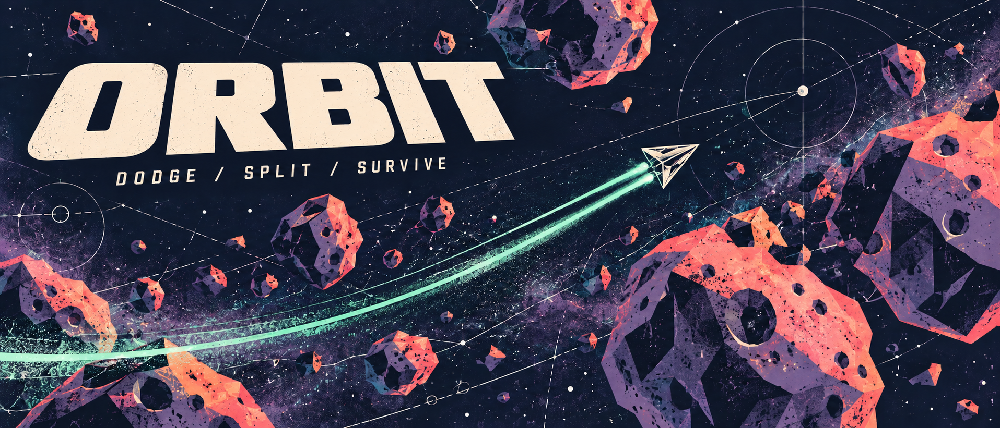
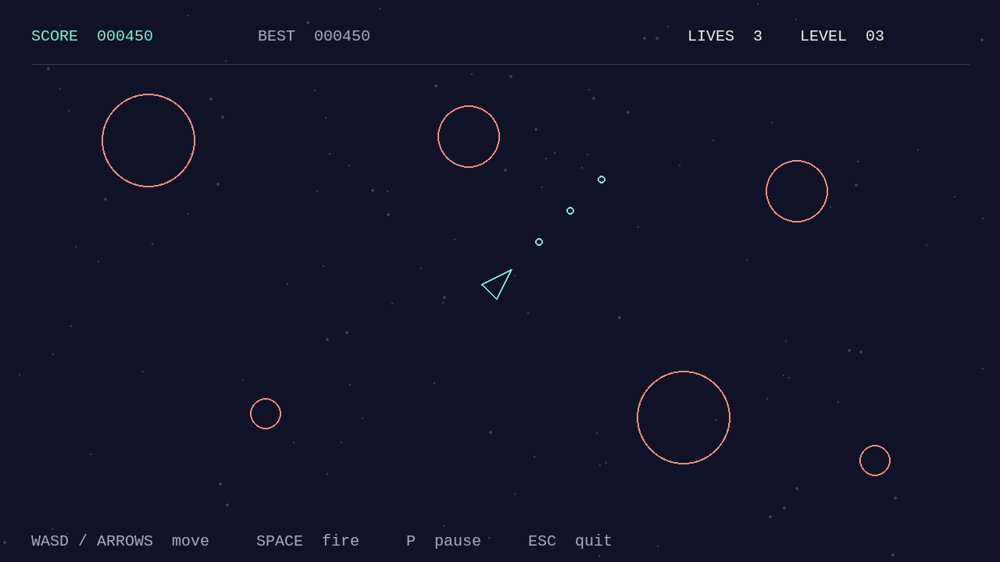
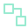
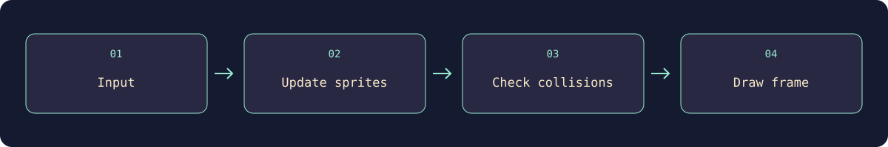

# Orbit — Asteroids Game

> **Learning Journey Projects · Boot.dev**
> A student project developed through the Boot.dev curriculum and extended through hands-on practice.

**A keyboard-controlled arcade game built with Python and Pygame.**

Pilot a wireframe ship through an asteroid field. Rotate, move, and fire at incoming rocks; survive with three lives and brief protection after each hit. Earn points by splitting rocks, with difficulty increasing every 20 seconds. The game uses a 1280 × 720 window and a loop capped at 60 frames per second.

##  Enter the asteroid field

Requires **Python 3.13+**, **uv**, and a graphical desktop.

```bash
./launch
```

| Key | Action |
| --- | --- |
| **W / S** or **Up / Down** | Move forward / backward |
| **A / D** or **Left / Right** | Rotate left / right |
| **Space** | Shoot |
| **Enter** | Start, resume, or play again |
| **P** | Pause / resume |
| **R** | Restart after game over |
| **Escape** or close window | Exit |



<sub>Deterministic scene rendered from the project’s sprite classes; a visual preview rather than a recorded gameplay session.</sub>

##  Inside every frame



Sprite groups coordinate updates and drawing. Circle-based collision checks connect shots, asteroids, and the player; asteroid spawning and splitting live in dedicated classes.

| Source | Responsibility |
| --- | --- |
| `main.py` | Window, event loop, and launch options |
| `game.py` | State transitions, lives, scoring, collisions, and persistence |
| `ui.py` | Shared HUD, menus, starfield, and reduced-motion presentation |
| `player.py` · `shot.py` | Ship controls and projectiles |
| `asteroid.py` · `asteroidfield.py` | Rocks, splitting, and spawning |
| `circleshape.py` | Shared circular shape and collision logic |
| `constants.py` | Dimensions, movement, and firing settings |

##  What this project teaches

Object-oriented design, vector movement, delta time, sprite groups, collision detection, state transitions, and resilient score persistence.

## Gameplay and options

The launcher uses uv to prepare the Python environment automatically and works
from another directory when invoked by absolute path. `uv run main.py` remains
available. The ship wraps around screen edges; shots expire after 1.6 seconds,
and off-screen rocks are removed. Small rocks score 100 points, medium rocks 50,
and large rocks 20. Each hit removes one life; respawns grant two seconds of
protection. Losing desktop focus pauses the run.

```bash
./launch --fullscreen
./launch --reduced-motion
```

Reduced motion disables particles and ship blinking; a steady ring still shows
protection. The best score is saved on game over or exit under
`$XDG_STATE_HOME/asteroids/best.json` (default `~/.local/state/asteroids/best.json`).
If saving fails, the best remains in memory and the menu shows a message.
The game has no audio and does not require external media downloads.

## Verify without a graphical desktop

```bash
uv run python -m unittest -v
SDL_VIDEODRIVER=dummy ./launch --start --seed 7 --frames 120 --no-save
```

Tests cover scoring, splitting, lives, invulnerability, pause/restart, focus loss,
object cleanup, score-save recovery, and rendering every screen. GitHub Actions
runs the tests and a deterministic headless launch. Optional `--screenshot PATH`
saves the final frame; `--no-save` keeps verification runs from writing scores.
[Design context](DESIGN.md) documents the shared presentation and controls.

---

Built by **[Abdulrahman M. Yaqyn](https://yaqyn.dev)** through the [Boot.dev](https://www.boot.dev) curriculum.

Best scores retain the legacy `$XDG_STATE_HOME/asteroids/best.json` location (default `~/.local/state/asteroids/best.json`) so existing saves survive the Orbit rename.
