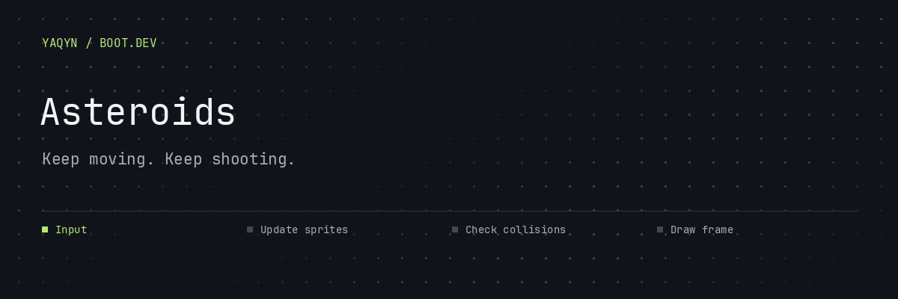
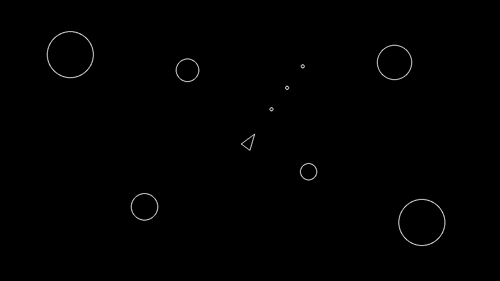

# Asteroids

**A keyboard-controlled arcade game built with Python and Pygame.**

Pilot a wireframe ship through an asteroid field. Rotate, move, and fire at incoming rocks; a collision with your ship ends the run. The game uses a 1280 × 720 window and a loop capped at 60 frames per second.

##  Enter the asteroid field

Requires **Python 3.13+**, **uv**, and a graphical desktop.

```bash
uv sync
uv run main.py
```

| Key | Action |
| --- | --- |
| **W / S** | Move forward / backward |
| **A / D** | Rotate left / right |
| **Space** | Shoot |
| Close window | Exit |



<sub>Deterministic scene rendered from the project’s sprite classes; a visual preview rather than a recorded gameplay session.</sub>

##  Inside every frame


Sprite groups coordinate updates and drawing. Circle-based collision checks connect shots, asteroids, and the player; asteroid spawning and splitting live in dedicated classes.

| Source | Responsibility |
| --- | --- |
| `main.py` | Window, loop, sprite groups, and collision handling |
| `player.py` · `shot.py` | Ship controls and projectiles |
| `asteroid.py` · `asteroidfield.py` | Rocks, splitting, and spawning |
| `circleshape.py` | Shared circular shape and collision logic |
| `constants.py` | Dimensions, movement, and firing settings |

##  What this project teaches

Object-oriented design, vector movement, delta time, sprite groups, and collision detection. This is a compact course game: the current loop exits on a player hit, with no score screen or restart menu.

---

Built by **[Abdulrahman M. Yaqyn](https://yaqyn.dev)** through the [Boot.dev](https://www.boot.dev) curriculum.
